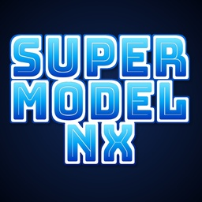

<p align="center"></p>

# SuperModel NX

**Sega Model 3 arcade emulator for Nintendo Switch** (homebrew `.nro`), a fork of
[Supermodel](https://www.supermodel3.com) created by **ToniiSound**.

- PowerPC → ARM64 recompiler (JIT), including floating point.
- Its own menu: list of the games on the SD card, logo, settings on the **+** button.
- Press − and + together during a game to go back to the game list.
- Resolution selector (1280x720, 960x540, 854x480) and on-screen FPS counter.

> No ROMs or NVRAM data are included: provide your own, and only use copies of games
> you own (see [Installing](#installing)).
> Not affiliated with or endorsed by Sega or Nintendo. Sega, Model 3 and the game
> titles are trademarks of their respective owners.

## Credits

- **Supermodel**: © 2003-2025 The Supermodel Team (Bart Trzynadlowski, Nik Henson,
  Ian Curtis and contributors). <https://www.supermodel3.com>
- **Libretro-Supermodel**: [libretro](https://github.com/libretro/Libretro-Supermodel) and
  [sgiannop](https://github.com/sgiannop/Libretro-Supermodel), the base of this fork and of
  the ARM64 recompiler.
- devkitPro and libnx, SDL2, Mesa, glad, Dear ImGui (Omar Cornut), Musashi (Karl Stenerud),
  zlib and minizip.
- Logo set in [Bungee Inline](https://fonts.google.com/specimen/Bungee+Inline) by David Jonathan Ross
  (SIL Open Font License).

The **Credits** tab of the settings menu (+) shows the same credits.

## License

GNU General Public License v3 or later: see [LICENSE](LICENSE). As a fork of Supermodel,
all the code in this repository is distributed under that same license.

## Technical overview

A standalone `.nro` port of Supermodel, built on
[Libretro-Supermodel](https://github.com/sgiannop/Libretro-Supermodel) for its PowerPC →
ARM64 recompiler. It uses Supermodel's SDL2 front end (with an ImGui game list), desktop
OpenGL through Mesa/EGL and libnx's JIT support.

## Building (WSL or Linux with devkitPro)

```sh
sudo dkp-pacman -S switch-dev switch-sdl2 switch-mesa switch-zlib
make -f Makefile.switch -j$(nproc)
```

Options:

| Option | Effect |
| --- | --- |
| `NXLINK=1` | Sends console output to the PC (`nxlink -s build/switch/supermodel.nro`) |
| `NO_JIT=1` | PowerPC interpreter only (to rule out recompiler bugs) |
| `DEBUG=1` | `-O1 -g` |

The output is `build/switch/supermodel.nro`.

## Installing

```
sdmc:/switch/supermodel/
├── supermodel.nro
├── ROMs/            ← your MAME-style ROM zips: scud.zip, vf3.zip, daytona2.zip…
└── NVRAM/           ← your NVRAM files (optional): daytona2.nv…
```

On first launch `Config/`, `NVRAM/`, `Saves/`, `Log/`, `Screenshots/` and `Assets/` are
created, and `Supermodel.ini`, `Games.xml` and `Music.xml` are copied. They are never
overwritten: edit `Config/Supermodel.ini` to change settings and controls, or use
**Load Defaults** in the General tab of the settings to restore them.

### NVRAM (cabinet settings)

Many Model 3 games keep their cabinet setup (single or linked cabinet, deluxe or twin,
etc.) in NVRAM. SuperModel NX does not include any NVRAM data: provide your own.

- **Your own NVRAM files**: copy them to `sdmc:/switch/supermodel/NVRAM/`, named after
  the ROM set (e.g. `daytona2.nv`, in Supermodel's `.nv` format).
- **Or set the game up once**: without an NVRAM file, a game may stop at its cabinet
  setup screen or wait for other linked cabinets. Open the game's test menu (Test button:
  right stick click), set it to a single cabinet with no link, leave the test menu and
  exit with − and +. The NVRAM is saved to `NVRAM/` and loaded every time after that.

To start a game's setup again from scratch, delete its `.nv` file from `NVRAM/`.

Launch the `.nro` **in title mode** (hold R while opening a game from the HOME menu) to
get all the memory. The recompiler needs Atmosphère.

Keep the folder name `supermodel`: the program reads and writes its files there.

## Menu

- The game list shows the games found in `ROMs/` (the **General** tab can show them all).
  Choosing a game with A starts it.
- **+** opens the settings: General, Core (PowerPC frequency), Video (resolution and
  other options), Audio and Credits. **+** again goes back to the list.
- HOME closes the program.

The header logo is built into the `.nro`: put `Assets/logo.bmp` in the project before
building (32-bit BMP for transparency; drawn up to 120 px high, keeping its proportions).
It is not read from the SD card. Without it the header shows "SuperModel NX".

## Default controls

| Button | Action |
| --- | --- |
| + / − | Start / Coin |
| Left stick, D-pad | Joystick, steering |
| ZR / ZL | Accelerate / brake, fire (gun games, Virtual On) |
| R / L | Shift up / down |
| A B X Y | Game buttons (VF3: Y guard, B punch, A kick, X escape) |
| Left / right stick click | Service / Test |
| − and + | Back to the game list |
| − + R / − + L | Save / load state |
| − + D-pad right | Change save state slot |
| − + D-pad down | Pause |

## Performance

- **Resolution** (Video tab): 960x540 draws the 3D scene at 720x540 and is noticeably
  faster than 1280x720 in demanding games (e.g. Daytona USA 2: ~38 → ~47 FPS in races).
- **VSync** is off by default, so games that run below 60 FPS don't drop in steps.
- **PowerPC frequency** (Core tab): Auto runs each game at its board's speed (Step 1.0:
  66 MHz, Step 1.5: 100 MHz, Step 2.x: 166 MHz). For a single game it can be set in its
  own section of `Supermodel.ini`, e.g. `[ daytona2 ]` + `PowerPCFrequency = 133`.
- `JitNativeFP = 1` (default) also recompiles PowerPC floating point to ARM64. If a game
  misbehaves (AI, physics, timing), set it to `0` in that game's section.
- Overclocking with sys-clk helps; `MultiThreaded = 1` spreads the main board, sound and
  drive board over the CPU cores.
- `ShowFrameRate = 1` ("Write FPS to Supermodel.log") writes the frame rate and timings
  to `Log/Supermodel.log` every 5 seconds.

## Changes from Libretro-Supermodel

- `Src/CPU/PowerPC/Jit/JitArm64.cpp`: dual mapping support (RW for writing, RX for
  executing) through libnx's `jit*` API (`Src/OSD/Switch/SwitchJit.c`), block chaining
  fixes and native floating point.
- `Src/OSD/Switch/`: SD card paths, OpenGL loading with glad, controller mappings, thread
  to core assignment, return to the game list, profiling.
- `Src/OSD/SDL/`: desktop OpenGL context on the Switch, controller-driven menu,
  on-screen FPS counter.
- `Src/Model3/Model3.cpp`: the libretro core option is only used in the libretro build.


This emulator is completely free and open-source. Optional donations to support the development are always welcome:

[](https://ko-fi.com/toniisound)
[](https://paypal.me/toniisound)
